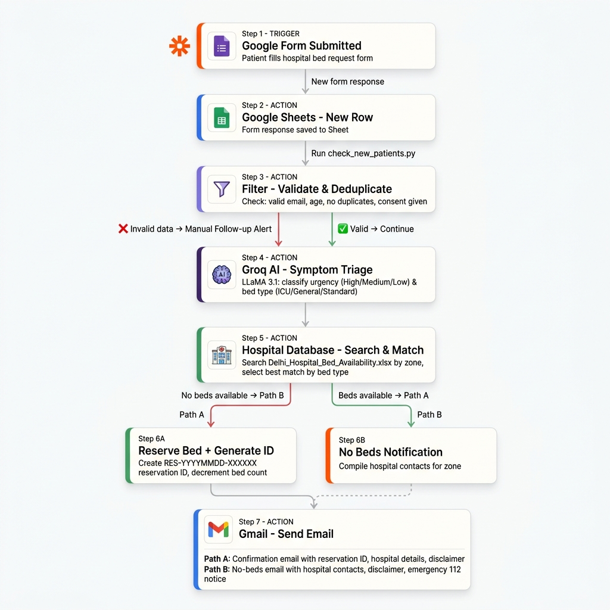

# Hospital Bed Request AI Agent (LangGraph)

A LangGraph reimplementation of the Zapier "AI-Powered Hospital Bed Allocation
System" workflow. Classifies patient urgency via Groq, searches a hospital
database by zone, reserves a bed if one is available, and emails the patient
— or sends a "no beds available" notification (Path B).

## ⚠️ Security note
The original spec documents this project was built from contained a
**live-looking Groq API key hardcoded in plaintext**. That key is not used
anywhere in this codebase. If it's a real key, rotate it in your Groq
dashboard immediately — treat it as compromised since it was pasted into a
shared document.

## Data source
Hospital data comes from a **local Excel file** (`data/Delhi_Hospital_Bed_Availability.xlsx`)
— no Google Sheets or service account needed. The file contains 18 real Delhi
hospitals with illustrative (non-live) bed counts:

| Column | Field |
|---|---|
| A | Hospital Name |
| B | Area / Zone (South Delhi, Central Delhi, West Delhi, South East Delhi, North East Delhi, East Delhi) |
| C | Total Beds |
| D | General Beds Available |
| E | ICU Beds Available |
| F | Contact Number |
| G | Last Updated |

The agent's "Available Beds" filter = General + ICU beds available, combined
(matching the single `Available Beds` column the original spec used).

To use your own hospital list, either replace this file (same column layout)
or point `HOSPITAL_DATA_FILE` in `.env` at a different `.xlsx` file.

## Setup

```bash
python3 -m venv venv
source venv/bin/activate
pip install -r requirements.txt
cp .env.example .env   # then fill in your real credentials
```

### Environment variables (`.env`)
| Variable | Required? | Notes |
|---|---|---|
| `GROQ_API_KEY` | No | Without it, triage uses safe defaults (`High` / `General`) |
| `GROQ_MODEL` | No | Defaults to `llama-3.1-8b-instant` — `mixtral-8x7b-32768` from the original spec has been decommissioned by Groq |
| `HOSPITAL_DATA_FILE` | No | Defaults to the bundled Delhi dataset |
| `HOSPITAL_DATA_SHEET_NAME` | No | Defaults to `Delhi Bed Availability` |
| `SMTP_HOST`, `SMTP_PORT`, `SMTP_USERNAME`, `SMTP_PASSWORD` | No | Without it, emails are logged instead of sent |

## Run

```bash
python main.py                  # runs 5 built-in example scenarios
python main.py --interactive    # prompts you for one patient request
python check_new_patients.py    # fetch & process new Google Form submissions
pytest -v                       # 34 unit + integration tests
```

## Live patient intake from Google Form

`check_new_patients.py` is an on-demand script you run manually whenever
you want to process new submissions from the linked Google Form.

**How it works:**
1. Downloads the "Form Responses 1" tab as a CSV (no API key needed — just
   "Anyone with the link can view" sharing).
2. Skips rows it has already processed (tracked in `processed_rows.json`).
3. Runs each new patient through the full LangGraph agent (triage → search
   → reserve/notify → email).
4. Prints a summary and flags any submissions with invalid data for manual
   follow-up (e.g. phone-only patients you can call directly).

**Finding the correct `FORM_RESPONSES_GID`:**
The default `FORM_RESPONSES_GID=0` is correct when "Form Responses 1" is
the **first tab** in the spreadsheet. If it isn't:
1. Open your spreadsheet in a browser.
2. Click the **Form Responses 1** tab at the bottom.
3. Look at the URL — it ends with `#gid=XXXXXXXX`.
4. Set `FORM_RESPONSES_GID=XXXXXXXX` in your `.env`.

**Additional `.env` variables for the intake runner:**
| Variable | Default | Notes |
|---|---|---|
| `SHEET_ID` | (the demo sheet ID) | The long ID in your Sheet URL |
| `FORM_RESPONSES_GID` | `0` | Tab gid for "Form Responses 1" (see above) |
| `PROCESSED_ROWS_FILE` | `processed_rows.json` | Where processed rows are tracked |

## Architecture



| File | Purpose |
|---|---|
| **state.py** | `HospitalState` TypedDict shared across all nodes |
| **tools.py** | Groq triage, hospital search (local Excel + 1hr cache), reservation IDs, SMTP email, validation |
| **nodes.py** | One function per graph step, reads/writes `HospitalState` |
| **graph.py** | Wires nodes + conditional Path A / Path B routing edge |
| **main.py** | CLI runner: 5 demo scenarios + `--interactive` mode |
| **patient_intake_source.py** | Fetches Google Sheet CSV, tracks processed rows |
| **check_new_patients.py** | On-demand runner: fetches → runs graph → summarises |
| **test_agent.py** | 34 pytest tests: validation, triage, routing (both paths), intake parsing |
| **data/Delhi_Hospital_Bed_Availability.xlsx** | Hospital database (18 Delhi hospitals) |

## What's changed vs. the original spec
- **Data source switched from Google Sheets to a local Excel file** — no
  Google Cloud project, service account, or API credentials needed for the
  hospital database.
- **Path B implemented** — the source Zap only had the "beds available"
  branch; the "no beds available" notification path was flagged as incomplete
  and is now fully built and tested.
- **Reservation IDs implemented** (`RES-YYYYMMDD-XXXXXX`), also flagged as
  pending in the spec.
- **API key removed from code** and moved to `.env`.
- **Groq model updated** — `mixtral-8x7b-32768` is no longer served by Groq;
  swapped for `llama-3.1-8b-instant`. Change `GROQ_MODEL` in `.env` if you
  prefer a different current model.
- **Runs without any live credentials** — logs emails instead of sending when
  SMTP isn't configured, so you can `python main.py` immediately.
- **On-demand Google Form intake** — `check_new_patients.py` reads live
  patient submissions from the linked Google Form/Sheet using the public CSV
  export (no service account, no OAuth, just link-viewable sharing).
